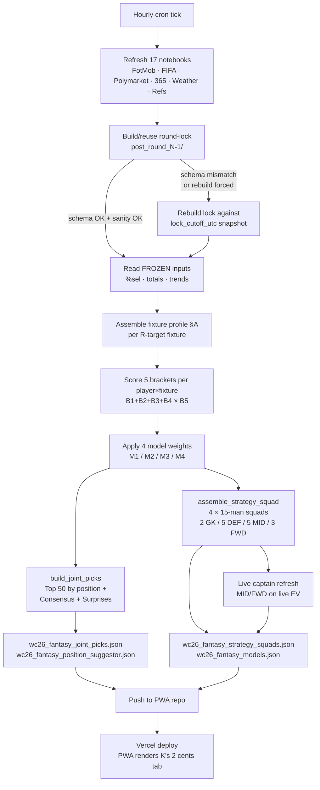
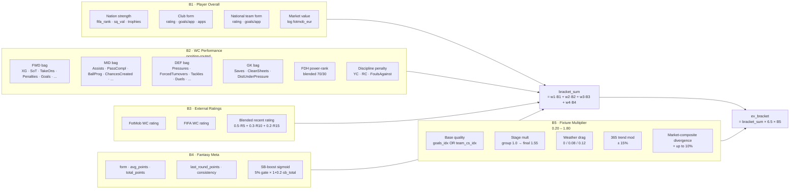
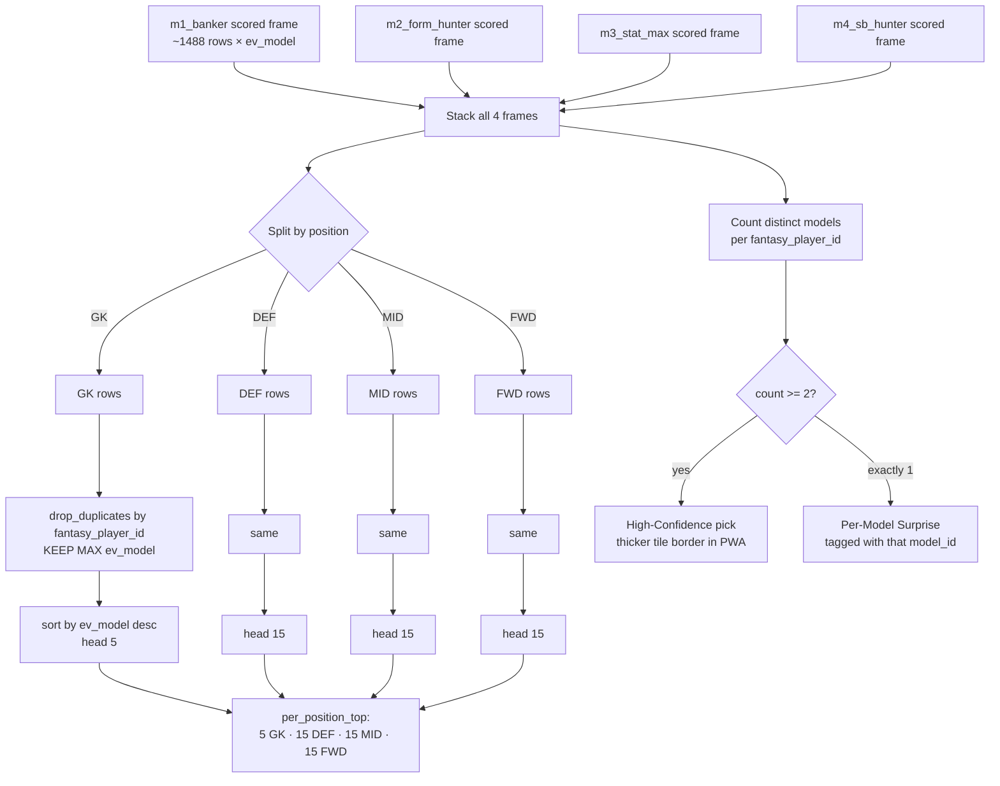
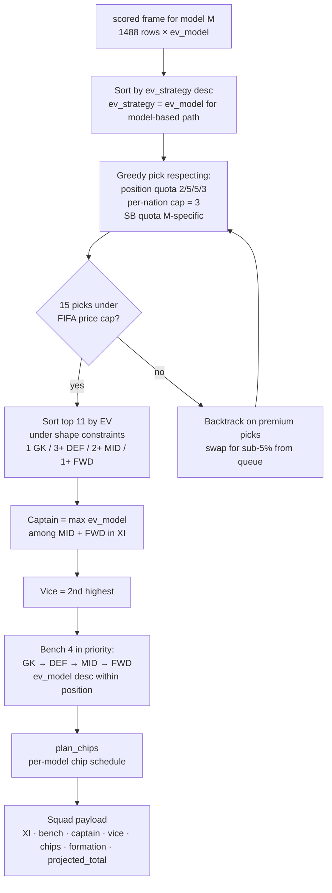

# K's 2 Cents — Model & Algorithm Explained (in plain English)

> Read this first. The Excel spec (`K_2_Cents_Model_Spec_v2.xlsx`) lists every
> factor; this doc tells the *story* of what the system actually does, in the
> order it does it, with diagrams.

Companion docs: `RECOMMENDER.md` (one-pager), `K_2_Cents_Model_Spec_v2.xlsx`
(deep tables), `STAGING_CONTRACT.md` (what the PWA reads).

---

## 0. What the system actually answers

The PWA's **Fantasy → K's 2 cents** tab is two things, side by side:

1. **Suggested Picks** — *"Out of the entire 1,488-player fantasy pool, which
   50 do I want to look at for this round?"*  → 5 GK · 15 DEF · 15 MID · 15 FWD.
2. **Fantasy Challenge** — *"If you had to build a 15-man squad right now
   under FIFA rules, what would 4 different personalities do?"* → 4 squads,
   each labelled M1/M2/M3/M4.

Both reuse the same scoring engine underneath. The difference is what gets
done with the scores — a list (top 50 per position) versus a constrained
squad (real FIFA rules: 2/5/5/3 shape, max 3 per nation, budget cap).

The user-facing rule we promised: **squads + the 50 stay STILL within a
round.** Only the captain badge and bench-priority order rotate, because
those benefit from live form. Everything else is decided once when the round
locks and held frozen until the next round.

---

## 1. The big picture in one diagram



Only ONE thing fetches live data inside this loop after the lock is built:
the captain refresh. Everything else reads from the lock dir, so the loop
is deterministic until the target round flips.

---

## 2. What data we have (mapping your sheet to our pipeline)

You shared a screenshot showing the data dictionary across these columns:

| Column in screenshot | What it is | Where it lives in our pipeline |
|---|---|---|
| `fotmob_wc_fotmob_rating` | FotMob average rating across WC | `wc26_stg_players_view.fotmob_wc_fotmob_rating` |
| `fotmob_wc_appearances` | # WC matches | `wc26_stg_players_view.fotmob_wc_appearances` |
| `wc_rating` | FIFA's per-match average rating | `wc26_stg_players_view.wc_rating` |
| `total_points` | Fantasy total points | `fantasy_players.total_points` (PROJECTED in lock — see §7) |
| `scouting_bonus` | Cumulative SB hits | `wc26_stg_fantasy_player_totals.scouting_bonus` |
| `fifa_wc_TimePlayed` | Minutes played | `wc26_stg_players_view.fifa_wc_TimePlayed` (REBUILT in lock — see §7) |
| `fifa_wc_Goals/Assists/XG/...` | The full FIFA stat catalogue | `wc26_stg_players_view.fifa_wc_*` (REBUILT in lock — see §7) |
| `fifa_wc_AttemptAtGoalOnTarget`, `Penalties`, `TakeOnsCompleted`, ... | FWD attacking stats | Feed B2 FWD positive bag |
| `fifa_wc_PassesCompleted`, `pass_completion_pct`, `LinebreaksAttempted`, ... | MID build-up stats | Feed B2 MID positive bag |
| `fifa_wc_DefensivePressuresApplied`, `ForcedTurnovers`, `CleanSheets`, ... | DEF stats | Feed B2 DEF positive bag |
| `fifa_wc_GoalkeeperSaves`, `DistributionsCompletedUnderPressure` | GK stats | Feed B2 GK positive bag |
| `fifa_wc_YellowCards`, `RedCards`, `FoulsAgainst` | Discipline | B2 discipline penalty (10% subtract) |
| `fotmob_wc_chances_created`, `big_chances_created`, `touches_opp_box`, `xg_against_on_pitch` | FotMob WC rollups | B2 MID/FWD + M3 creativity_engine post-boost |
| `recent5/10/15_*` columns | Form windows (FotMob) | B3 blended recent rating + M2 form_streak post-boost |
| `nation_id`, `position`, `price`, `percent_selected`, `form`, `last_round_points` | Identity + fantasy meta | B1 (nation_strength composite), B4 (b4_fantasy bracket) |

**Yes, every single one of those columns is used.** B2 is the heaviest user
of the FIFA stat catalogue — positions are routed to their own positive bag.
M3 Stat Maximizer specifically leans on the FotMob columns (chances created,
big chances, touches opp box) via the `creativity_engine` post-boost.

---

## 3. How a player score is built (the 5 brackets in plain English)

For each (player, fixture) pair we make a single number: `ev_model`. That
number is "expected fantasy points this player will deliver in this fixture
under this model". It's built from 5 sub-scores called brackets.



### B1 Player Overall — "is this player on a real team, and have they been one before"

Weighted from nation strength (sheet 6 of the Excel), club rating, club
goals-per-appearance, club apps, national team rating, national team
goals-per-appearance, log market value. Attack components (goals-per-app)
contribute 0 weight for DEF/GK, so we re-normalise so DEF/GK aren't punished.

### B2 WC Performance — "how have they actually played in this WC, given their job"

This is where the FIFA stat catalogue you screenshotted does the heavy
lifting. We pick a different bag of stats per position:

- FWD: shots on target, attempts, XG, take-ons, penalties, goals, touches in
  opp box, speed runs, attacking-reception %, shot-ending sequences
- MID: passes completed, pass-completion %, ball progressions, switches of
  play, line-breaks, FotMob chances created + big chances, involvements
- DEF: defensive pressures, forced turnovers, tackles, duels won %, clean
  sheets, crosses, line-breaks under pressure
- GK: saves, clean sheets, distributions under pressure

Within position, every stat is converted to per-90 minutes (skipped if the
stat is already a % column — those are rates), then rank-percentiled across
all players in that position. The mean of those percentiles is the position
score. Then we blend it 70/30 with FDH (FIFA's official power-rank
endpoint) score percentile. Discipline (yellows, reds, fouls-against per-90)
is rank-percentiled inverse and subtracted at 10% weight.

### B3 External Ratings — "do other observers also think they're playing well"

A simple blend of FotMob's WC rating, FIFA's WC rating, and a recency-weighted
average of FotMob's recent 5/10/15-match ratings (50/30/20). All rank-
percentiled.

### B4 Fantasy Meta — "what's the FIFA Fantasy app saying"

Form, avg points, total points, last-round points, consistency (1 −
stdev/mean across `round_points_json`), and an SB-boost. The SB-boost is the
clever piece: it's a sigmoid centred at 5% ownership times (1 + 0.2 × clip
of SB total). Sub-5% picks who've already hit SB are worth amplifying — they
fire +2 if at least 50% of the field doesn't own them and they score 7+.

### B5 Fixture Multiplier — "how good is this matchup for this player"

A multiplier in [0.20, 1.80], composed of:

- Base: for FWD/MID, `(0.5 + goals_index)` (high-scoring fixture) times an
  opponent-weakness boost times a heavy-hitter boost. For DEF/GK, swap
  goals_index for team clean-sheet index.
- Stage multiplier: group 1.00, R32 1.15, R16 1.25, QF 1.40, SF/Final 1.55.
- Weather drag: clusters 0/1/2/3 = 0/0.08/0.12/0 drag (heavy rain costs
  goals; clear/hot doesn't matter).
- 365 trend modifier: ±15% from the top trend's confidence calibrated by
  category.
- Market-composite divergence: up to +10% when Polymarket and our
  nation-strength composite disagree (upset opportunity).

### Bringing them together

```
bracket_sum = w1·B1 + w2·B2 + w3·B3 + w4·B4
ev_bracket  = bracket_sum × 6.5 × B5
```

The default weights `(w1,w2,w3,w4) = (0.20, 0.30, 0.20, 0.30)`. Each model
overrides them. The factor of 6.5 puts the number on FIFA-points scale — a
top elite player on a great fixture lands around 12 EV before captain ×2.

---

## 4. The 4 model personalities (Model Registry)

Same player attributes go in, four different opinions come out. Each model
re-weights the 4 brackets and may add a "post-boost" extra term, then has
its own SB-slot quota (how many of the 15-man squad must be from sub-5%).

| Model | Personality (one line) | w_B1 | w_B2 | w_B3 | w_B4 | SB quota | Post-boost |
|---|---|---|---|---|---|---|---|
| **M1 Banker** | "The safe-and-rich pick" — premium players on favoured fixtures. Floor-heavy. | 0.20 | 0.25 | 0.20 | 0.35 | 9 / 15 | none |
| **M2 Form Hunter** | "Who's hot right now?" — punishes cold streaks, rewards recent goals/POM. | 0.10 | 0.20 | 0.40 | 0.30 | 6 / 15 | recent5/10 goals, started %, POM, last-round |
| **M3 Stat Max** | "Forget the crowd, pick the best" — ignores ownership entirely. Pure FIFA-stat + creativity engine. | 0.15 | 0.50 | 0.25 | 0.10 | 3 / 15 | chances created, touches opp box, line-breaks, FDH power-rank pure |
| **M4 SB Hunter** | "Differentials only" — 12 sub-5% slots + 3 anchors (2 sure-shot FWDs + 1 influential MID). | 0.20 | 0.30 | 0.20 | 0.30 | 12 / 15 | sure_shot_fwd + influential_mid (surfaced for assembler) |

Each model also has a `fixture_amplifier` (how much of B5 to apply — M2 uses
0.85 because recent form should outweigh fixture; the rest use 1.0) and a
`chip_plan` (which round to fire each chip — see §9 for the R32 chip plan).

---

## 5. How we get to the 50 Suggested Picks (separate explanation)

This is `lib/recommender.py:build_joint_picks(model_outputs, top_n=30)`. The
50 picks are NOT 12 from each model averaged — they're per-position picks
pulled from the FULL scored frame.



Why pull from the FULL scored frame and not from each model's top-30?
Because some models' top-30 has zero GKs. If you stack 4 top-30 unions and
get 0 GKs, the 5-slot GK quota can never fill. Pulling per-position from the
full scored frame guarantees the 5/15/15/15 shape regardless of model bias.

**Consensus** (≥2 models picked) and **Surprises** (exactly 1 model picked)
are computed by counting how many models had each player in their top-30.
Same set of underlying players; just a different lens for the PWA.

**SB Eligible** filter on the PWA is LIVE (it reads the FIFA Fantasy live
ownership map, not the frozen one). The frozen ownership feeds scoring; the
live ownership feeds the user's UI filter pill. Both correct.

---

## 6. How we get to the 4 Strategy Squads (separate explanation)

This is `lib/recommender.py:assemble_strategy_squad(scored, strat, ...)` for
M1/M2/M3 and `assemble_sb_hunter_squad(...)` for M4. One scored frame goes
in per model, one 15-man squad comes out, complete with captain, vice,
bench order, and chip plan.



**M4 SB Hunter uses a different assembler** — it pulls 2 sure-shot FWDs
from the `boost_sure_shot_fwd` column top, 1 influential MID from
`boost_influential_mid` top, then fills the other 12 slots from sub-5%
ownership under the same shape constraints. The 12-of-15 SB ratio is the
whole point: maximise SB +2 hits if differentials fire.

**Per-nation cap = 3** is the FIFA rule. The assembler enforces it on the
sorted greedy path.

**Captain refresh** runs AFTER the squad is locked. One more scoring pass
under Banker weights using LIVE %selected → captain re-picked from MID+FWD
on `ev_live`. Bench re-ordered within position groups by `ev_live`. This is
the only thing that rotates within a round — and intentionally so, because
"who should I captain right now" benefits from fresh form.

---

## 7. Lock & freeze — why the squads don't drift, and how (schema v5)

**The promise**: within a round, the 4 squads + the 50 picks + the consensus
+ surprises are STILL. Only the captain badge + bench order rotate.

**The mechanism**: a "lock dir" at `data/processed/locked/post_round_{N-1}/`
that contains a frozen copy of every parquet the recommender reads. The
recommender rebinds `lib.recommender.PROC` to the lock dir at scoring time,
so every `pd.read_parquet(PROC / "...")` reads from the frozen snapshot.

```mermaid
flowchart TD
    A[Cron tick fires] --> B{lock dir exists?}
    B -->|no| BUILD[Build new lock]
    B -->|yes| CHECK[3-step reuse check:<br/>1) all lib parquets present<br/>2) manifest schema == 5<br/>3) TimePlayed.max ≤ lock_round·110<br/>4) fantasy_players max round ≤ lock_round]
    CHECK -->|all pass| REUSE[Reuse existing lock]
    CHECK -->|any fail| RMLOCK[Wipe lock] --> BUILD
    BUILD --> CUTOFF[Compute lock_cutoff_utc<br/>= min R-target kickoff − 1h]
    CUTOFF --> BULK[Bulk-copy 40 parquets<br/>defensive default]
    BULK --> FILTERMATCH[Filter per_match parquets<br/>by match_number ∈ lock window]
    FILTERMATCH --> FILTERROUND[Filter round_stats by round_id ≤ lock_round]
    FILTERROUND --> REBUILD[Rebuild aggregates<br/>stg_players_view · stg_player_powerrank ·<br/>stg_fantasy_player_totals · stg_players]
    REBUILD --> FOTMOB[Rebuild fotmob_wc_* in stg_players_view<br/>track 1 recoverable from per-match<br/>track 2 scaled by lock/live apps ratio]
    FOTMOB --> PROJ[PROJECT fantasy_players<br/>re-derive total/last/avg/form/round_points<br/>from round_points_json filtered to ≤ lock_round]
    PROJ --> TRENDS[Filter wc26_match_trends_365<br/>by snapshot_ts ≤ cutoff_utc]
    TRENDS --> FREEZE[Freeze live %selected<br/>fetch ONCE → _locked_percent_selected.json]
    FREEZE --> STAMP[Stamp manifest:<br/>schema · cutoff · projection audit ·<br/>trend filter audit · bulk-mtimes]
    STAMP --> REUSE
```

### What's frozen vs what stays live

| Component | Frozen at lock build | Why |
|---|---|---|
| `fantasy_player_round_stats` | YES, filtered ≤ lock_round | Per-round ground-truth points |
| `wc26_player_match_stats_wide` | YES, filtered match ∈ window | Per-match FIFA stat detail |
| `wc26_player_match_powerrank` | YES, filtered same window | Per-match power-rank |
| `wc26_stg_team_match_metrics` | YES, filtered same window | Per-match team stats |
| `wc26_stg_players_view` (fifa_wc_* + fotmob_wc_*) | YES, rebuilt from filtered | The 100+ cumulative WC stats |
| `wc26_stg_player_powerrank` | YES, rebuilt | Tournament-avg power-rank |
| `wc26_stg_fantasy_player_totals` | YES, rebuilt | SB total + appearances + starts |
| **`fantasy_players`** (total/last/avg/form/round_points_json) | YES, PROJECTED (v5+) | Closes the bulk-copy leak |
| **`wc26_match_trends_365`** | YES, filtered snapshot_ts ≤ cutoff (v5+) | Trends evolve hour-to-hour |
| `wc26_match_polymarket_markets` | BULK-COPIED, mtime stamped | No per-snapshot key in source |
| `wc26_match_weather` | BULK-COPIED, mtime stamped | Forecast, ~stable per match |
| **`_locked_percent_selected.json`** | YES, fetched ONCE (v4+) | Closed the sigmoid drift leak |
| `fantasy_round_matches` | BULK-COPIED | Need R-target fixtures for scoring |
| Polymarket fixture profile (B5 inputs) | EFFECTIVELY FROZEN — reads from bulk-copy | We accept that p_home_win / p_over_2_5 are last refresh |
| Live captain refresh | NO, fetches live %sel post-emit | Only thing that rotates within a round |
| PWA live ownership counter | NO, edge proxy 60s cache | Display only, doesn't feed scoring |

### The 4 layered defences (in order of how leakage was discovered)

1. **Per-match filter on stats** — wide / powerrank / team_metrics filtered by
   match_number ∈ lock window. Aggregates rebuilt from filtered sources.
2. **fotmob_wc_* recompute** — FotMob's pre-aggregated rollup was "now",
   so we re-do it: recoverable counters from per-match in window, others
   scaled by `lock_apps/live_apps`. Rates kept as-is.
3. **Frozen `_locked_percent_selected.json`** (v4) — b4's sigmoid SB-boost
   was the steepest leak: 5%-ownership flip causes ev_model to jump → squads
   reshuffle every cron tick.
4. **Projected `fantasy_players` + filtered 365 trends** (v5) — closes the
   bulk-copy back-door. Now even if MD3 actually plays and a future rebuild
   fires, the rebuilt lock reproduces the SAME pre-MD3 state because the
   projection is keyed off `lock_round` and `lock_cutoff_utc`, not "current".

### Schema version is the cache-revival killer

`LOCK_SCHEMA_VERSION = 5`. Stamped into `_lock_manifest.json`. On reuse, the
manifest version must match the code version. If GHA actions/cache restores
an older lock built under v3 or v4 semantics, the schema check fails → wipe
→ rebuild with current code. This is what stops a fix-then-poisoned-cache
cycle from re-emitting bad picks for 24 hours like it did pre-v3.

### The reuse sanity walk

Every reuse runs four checks:

```
1. All 15 parquets lib/recommender.py reads are present in lock_dir
2. manifest.schema_version == 5
3. wc26_stg_players_view.fifa_wc_TimePlayed.max() ≤ lock_round × 110
4. fantasy_players.round_points_json max round ≤ lock_round   (v5+)
```

Any failure → `shutil.rmtree(lock_dir)` → fresh rebuild against
`lock_cutoff_utc`. Because the cutoff is computed from `fantasy_round_matches`
(stable), the rebuild reproduces the same state.

---

## 8. Why "the logic kept breaking when a new match happened"

You correctly noticed: every time we fixed the lock, a new match would land
and the squads/suggestions would shift again. Three reasons, all closed:

| When | Symptom | Root cause | Fix |
|---|---|---|---|
| Pre-v3 | R3-contaminated picks re-emit every tick despite code fix | GHA actions/cache restored older lock dir; lock_dir.exists() ⇒ reuse without semantic check | `LOCK_SCHEMA_VERSION` bumped → mismatch forces rebuild |
| Pre-v4 | Squads + 50 changed every cron tick even with no new match data | Live %selected fetched every tick → b4 sigmoid SB-boost steep at 5% gate → ev_model reshuffles | Freeze `_locked_percent_selected.json` ONCE at lock-build; only captain refresh fetches live |
| Pre-v5 | Lock would silently re-poison the *next* time any rebuild fired (after MD3 plays) | `fantasy_players.parquet` and `wc26_match_trends_365.parquet` were bulk-copied; rebuild captures THEN-current state, not the lock_cutoff state | Project fantasy_players from round_points_json; filter 365 trends by snapshot_ts ≤ cutoff; record cutoff in manifest |

Each defence is independent. v5 is the durable design — once landed, the
lock dir is a time-capsule keyed to a fixed cutoff, and any rebuild
reproduces the same bounded inputs.

---

## 9. R32 chip plan — 12th Man only (your separate task)

You flagged R32 as a different beast: unlimited transfers reset, wildcard
banned, qualification booster + mystery booster unlock. Your call: keep it
simple — use ONLY the 12th Man booster across the 4 strategy squads, none
of the others.

The current code has a per-model chip plan in
`lib/recommender.py:_CHIP_PLAN_BY_MODEL`. Today it stamps:

```
m1_banker:      wildcard=R3, 12th_man=R8, max_captain=R6, qualification=R7, mystery=R4
m2_form_hunter: wildcard=R5, 12th_man=R4, max_captain=R7, qualification=R6, mystery=R4
m3_stat_max:    wildcard=R8, 12th_man=R5, max_captain=R8, qualification=R7, mystery=R5
m4_sb_hunter:   wildcard=R5, 12th_man=R4, max_captain=R4, qualification=R5, mystery=R6
```

Your rule for R32 onwards = R4..R8:

- **12th Man** — fire once in this window for each model. Suggested
  cadence: stagger across the 5 KO rounds so one model's 12th Man covers
  each round.
- **All other boosters** (Wildcard, Max-C, Qualification, Mystery, CSS) — do
  NOT use.

If you want me to bake this into the chip planner, I'd:

1. Replace `_CHIP_PLAN_BY_MODEL` for R32+ rounds with a simple table:

| Model | 12th Man round |
|---|---|
| M1 Banker | R4 (R32) |
| M2 Form Hunter | R5 (R16) |
| M3 Stat Max | R6 (QF) |
| M4 SB Hunter | R7 (SF) |

(Final round left chip-free — the squad EV does the talking.)

2. Set every other chip's round to `None` in the model output, so the PWA
   renders "no chip" for those.
3. Drop the `qualification_booster` + `mystery_booster` keys from the chip
   plan output entirely so the UI doesn't show them.

That's a small change to `plan_chips` + the model output emit. Tell me to
do it and I will — separate from the lock work above.

---

## 10. Quick map: file → purpose

| File | What it does |
|---|---|
| `lib/recommender.py` | The model. Bracket scorer, model registry, fixture profiler, nation strength, archetype miner, squad assemblers, round-tracking, position suggestor. ALL the math. |
| `lib/scores365.py` | 365scores trend fetcher. |
| `17_fantasy_recommender.py` | The orchestrator. Picks target round, builds/reuses lock, runs scoring, emits JSONs, refreshes captain, writes history snapshot. |
| `17a_eda_factor_signal.py` | One-shot EDA validating each factor against actual fantasy points. Not on cron. |
| `_build_*_nb_*.py` | Notebook builders. nb_14 staging core, nb_16 player view + powerrank, etc. The recommender's lock rebuild mirrors nb_14 §4-5 + nb_16 Block B. |
| `build_model_spec_xlsx.py` | Regenerates the v1 Excel from current model state. |
| `data/processed/locked/post_round_{N}/` | The lock dir. 40 parquets + `_lock_manifest.json` + `_locked_percent_selected.json`. |
| `data/processed/history/round_{R}/snapshot_*.json` | Per-cron-tick snapshot of recommendations + squads. Used for "what did we say last Tuesday?" audits. |
| `data/processed/json/wc26_fantasy_*.json` | The 5 JSONs the PWA reads (joint_picks, models, position_suggestor, strategy_squads, round_tracking) + recommendations.json. |

---

## 11. Companion reads

- `K_2_Cents_Model_Spec_v2.xlsx` — the deep-dive tables. 14 sheets. Use this
  when you need to look up a specific weight or factor without re-reading the
  code.
- `RECOMMENDER.md` — the one-pager. Status + per-model blurbs.
- `STAGING_CONTRACT.md` — what the PWA reads, what it shouldn't read.
- `REFRESH.md` — the cron + bucket definitions.

If you find anything in this doc that disagrees with the code, the code wins
and this doc gets updated. Treat this as the *current* explainer, not a
historical artefact.
